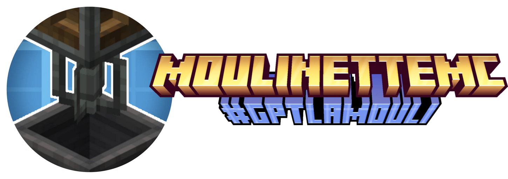
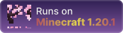
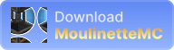
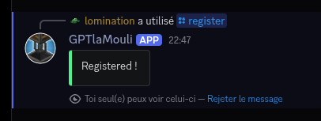

<div align="center">
  
  <h1>Bienvenue sur MoulinetteMC !</h1>

  
  
  

  <br>
</div>

**`MoulinetteMC`** est un serveur SMP moddé **privé** basé sur l'ingénierie et la technologie.

<div align="center">
  <a href="https://github.com/MoulinetteMC/MoulinetteMC/archive/refs/heads/main.zip">
    
  </a>
</div>
<br>

**Si vous rencontrez des problèmes, n’hésitez pas à contacter <a href="https://discord.com/users/594919283893469210"></a> ou <a href="https://discord.com/users/415397616507944961"></a> !**

La partie [Installation](#-installation) ne devrait être faite **qu’une seule fois** (à moins que vous ayez réinstallé votre launcher). La partie **[Jouer](#jouer)** décrit les instructions qui devront être répétées **à chaque fois que vous voulez vous connecter** au serveur.

- [Installation](#-installation)
  - [Installer un launcher](#installer-un-launcher)
    - [Prism Launcher (officiel)](#prism-launcher-officiel)
    - [Prism Launcher sur le PIE (officiel)](#prism-launcher-sur-le-pie-officiel)
    - [UltimMC (crack)](#ultimmc-crack)
  - [Configurer une instance](#configurer-une-instance)
  - [Authentification via Discord](#authentification-via-discord)
- [Jouer](#-jouer)
- [Troubleshooting](#troubleshooting)
  - [Crash au lancement à cause d’une OutOfMemoryError](#crash-au-lancement-à-cause-dune-outofmemoryerror)
  - [Prism Launcher Linux : drivers ou libraries non trouvées](#prism-launcher-linux--drivers-ou-libraries-non-trouvées)
- [FAQ](#faq)
  - [Peut-on jouer en crack ?](#peut-on-jouer-en-crack-)
  - [Comment changer le pseudo minecraft lié à son compte discord ?](#comment-changer-le-pseudo-minecraft-lié-à-son-compte-discord-)

#  Installation

## Installer un launcher

_Il est tout a fait possible de lancer le jeu avec le launcher par défaut de Minecraft_. Toutefois, il est recommandé d'utiliser un launcher communautaire comme **[MultiMC](https://multimc.org/)** ou **[Prism Launcher](https://prismlauncher.org/)**.

Dans ce guide, nous allons nous concentrer sur deux d’entre eux : Prism Launcher et UltimMC. Nous vous **conseillons fortement d’utiliser Prism Launcher** sauf dans le cas où vous ne disposez pas de compte Microsoft avec Minecraft dessus. Dans ce cas, utilisez UltimMC.

> [!IMPORTANT]
> Nous sommes en aucun cas responsable des cadres d'utilisation de votre compte Microsoft ainsi que de votre utilisation d'un logiciel cité dans ce guide.

<details>
  <summary>
  
  ### Prism Launcher (officiel)

  </summary>
  <p><blockquote>

Pour commencer, rendez-vous sur le [**site de Prism Launcher**](https://prismlauncher.org/download/). Sélectionnez votre OS (Linux, macOS, Windows) et **suivez les instructions d'installation**.

Une fois l'installation terminée, lancez Prism Launcher. Le launcher vous demandera de vous authentifier. **Connectez-vous** à votre compte Microsoft sur lequel Minecraft figure dans votre catalogue.

Vous devriez ensuite tomber sur cette page :


  </blockquote></p>
</details>

<details>
  <summary>
  
  ### Prism Launcher sur le PIE (officiel)

  </summary>
  <p><blockquote>

> [!NOTE]
> Cette section est dédiée aux joueurs sur le PIE (Parc Informatique de l'EPITA). L'installation devra être réalisée à chaque fois puisque Prism Launcher n'est pas déclaré par défaut dans la condfiguration NixOS.

Ouvrez un terminal et exécutez la commande suivante :

```bash
nix-shell -p prismlauncher --command prismlauncher
```

Choisissez la langue de votre choix.

**Veillez à selectionner la version 17 de Java, le modpack de MoulinetteMC n'étant compatible qu'avec cette version.**

Connectez vous ensuite à votre compte Minecraft / Microsoft en suivant les instructions à l'écran.

Une fois ces étapes faites, vous devriez tomber sur cette page :


  </blockquote></p>
</details>

<details>
  <summary>
  
  ### UltimMC (crack)

  </summary>
  <p><blockquote>

Pour commencer, rendez-vous sur le repository [**GitHub de UltimMC**](https://github.com/UltimMC/Launcher?tab=readme-ov-file#downloading). Téléchargez UltimMC en cliquant sur votre OS (Linux, macOS, Windows), puis unzippez le launcher à l’endroit de votre choix.

Une fois l’installation terminée, lancez UltimMC. Vous devriez ensuite tombez sur cette page :


Cliquez en haut à droite de la fenêtre sur `Profiles` pour configurer votre utilisateur Minecraft. Une autre fenêtre devrait s’ouvrir :


Cliquez sur `Add local` et saisissez le nom d’utilisateur Minecraft que vous souhaitez. **Ce nom vous sera demandé lors de l’authentification par Discord.** Ensuite, fermez la fenêtre.

Vous devriez voir votre nom d’utilisateur apparaître en haut à droite de votre écran à la place de `Profiles` comme ci-dessous :


  </blockquote></p>
</details>

## Configurer une instance

Il faut maintenant que vous configuriez une nouvelle instance de Minecraft sur votre launcher.

Commencez par **télécharger le modpack** ci-dessous. Il contient les mods nécessaires au premier lancement du jeu et la configuration client par défaut. **N’unzipez pas le modpack**, votre launcher s’en charge pour vous.

<div align="center">
  <a href="https://github.com/MoulinetteMC/MoulinetteMC/archive/refs/heads/main.zip">
    
  </a>
  <br>
</div>

Allez ensuite sur l’écran d’accueil de votre launcher. Cliquez sur le bouton `Add Instance` en haut à gauche de votre écran. Une nouvelle fenêtre devrait s’afficher sur votre écran :

| Prism Launcher                   | UltimMC                          |
| -------------------------------- | -------------------------------- |
|  |  |

Cliquez sur `Import` depuis le menu vertical de gauche. Puis, cliquer sur le bouton `Browse` pour parcourir vos fichiers. **Sélectionnez ensuite le modpack `MoulinetteMC-main.zip`** précédemment téléchargé.

Enfin, si vous le souhaitez, vous pouvez **donner un nom** (celui que vous voulez) à votre instance en haut de la fenêtre. Vous devriez obtenir quelque chose qui ressemble à ça :

| Prism Launcher                   | UltimMC                          |
| -------------------------------- | -------------------------------- |
|  |  |

Vous pouvez maintenant cliquer sur `OK`. Patientez le temps que le launcher crée l’instance.

## Authentification via Discord

Avant de pouvoir vous connecter au serveur, il vous reste une dernière étape. Vous devez vous **authentifier**. Pour ce faire, aller sur le **serveur Discord des classes Anglophones**.

Vérifiez que vous possédez bien le rôle `#GPTlaMouli`, si ce n'est pas le cas, demandez le à <a href="https://discord.com/users/594919283893469210"></a> ou <a href="https://discord.com/users/415397616507944961"></a> dans le salon `#🎮▸gaming`.

Utilisez ensuite la commande `/register` dans n’importe quel salon, suivie votre **nom d’utilisateur Minecraft**. Normalement, le bot **GPTlaMouli** devrait répondre “Registered !” comme ci-dessous :

<div align="center">
  
</div>

> [!NOTE]
> La commande `/register` ne peut qu'être utilisé qu'une seule fois. [Il est cependant possible de se rename.](#comment-changer-le-pseudo-minecraft-lié-à-son-compte-discord-)

Et voilà ! Vous êtes maintenant enregistré !

Assurez-vous d'avoir activé les **messages privés** provenant des membres du serveur ! Sinon, vous ne recevrez pas les messages de GPTlaMouli et par conséquent vous ne pourrez pas vous connecter à la MouliMC.

#  Jouer

Lancez votre instance précédemment configurée en cliquant deux fois dessus ou en la sélectionnant puis en cliquant sur `Launch` dans le menu à droite votre écran.

Une fois votre jeu lancé, il vous suffit de cliquer sur le bouton `Multiplayer` du menu de Minecraft pour vous connecter au serveur. Vous serez **automatiquement connecté à MoulinetteMC**, pas besoin de renseigner l'IP du serveur !
Vous devriez tomber sur cette page :


Ouvrez Discord. GPTlaMouli devrait vous envoyer un message privé comme ci-dessous:

<div align="center">
  
</div>

Cliquez sur `Yes` et revenez sur Minecraft.

**Veuillez ne pas accepter une demande de connexion qui ne vient pas de vous !**

> [!IMPORTANT]
> Nous pouvons certes vous accorder assistance. Cependant, nous sommes ne sommes pas responsable si vous avez accepté une demande de connexion par mégarde.

Lors de la première connexion ou lorsque le modpack a été mis à jour, un court chargement apparaîtra accompagné d’une douce musique 🎵. Les mods sont simplement en train d’être mis à jour sur votre client. Une fois le chargement terminé, vous devez relancer votre jeu pour charger les mods qui viennent d'être téléchargés.

Vous êtes maintenant connecté et vous pouvez jouer ! Amusez-vous bien !

# Troubleshooting

<details>
  <summary>
  
  ## Crash au lancement à cause d’une `OutOfMemoryError`
  
  </summary>
  <p><blockquote>

Il arrive que le jeu crash lors du chargement de Minecraft à cause d’un manque mémoire vive.

Pour résoudre ce problème, allez dans les paramètres de l’instance (sélectionnez l’instance dans votre launcher et cliquez `Edit` sur Prism Launcher ou `Edit Instance` sur UltimMC), dans l’onglet `Settings` puis `Java`.

Modifiez la valeur `Maximum memory allocation` à `2048 MiB` (soit `2 GiB`) ou plus.

Il est d'ailleurs recommandé de définir la même valeur pour `Minimum memory allocation`.

| Prism Launcher                    | UltimMC                           |
| --------------------------------- | --------------------------------- |
|  |  |

Relancez votre jeu et le problème devrait être résolue !

  </blockquote></p>
</details>

<details>
  <summary>
  
  ## Prism Launcher (Linux) : Drivers ou libraries non trouvées

  </summary>
  <p><blockquote>

Prism Launcher semble avoir une drôle de gestion de dépendances. Si vous rencontrez des problèmes de drivers ou de libraries telles que `libstdc++` qui ne sont pas trouvés ou pas dans la bonne version, contactez <a href="https://discord.com/users/594919283893469210"></a>. Il pourra peut-être vous aider.

  </blockquote></p>
</details>

# FAQ

<details name="question">
  <summary>
  
  ## Peut-on jouer en crack ?

  </summary>
  <p><blockquote>

Oui, il vous suffit d'utiliser UltimMC au lieu de Prism Launcher.
Notez cependant que cette méthode ne fonctionne pas sous NixOS.

  </blockquote></p>
</details>

<details name="question">
  <summary>
  
  ## Comment changer le pseudo Minecraft lié à son compte Discord ?

  </summary>
  <p><blockquote>

Si vous vous êtes trompé de nom lors du `/register` ou que vous souhaitez jouer avec un autre compte minecraft, vous pouvez vous renommer. Pour cela, utilisez la command `/rename` suivie de votre nouveau nom Minecraft.

Notez qu'utiliser à nouveau la commande `/register` produira une erreur de ne fonctionnera pas. Le `/register` ne peut qu'être utilisé une seule fois.

  </blockquote></p>
</details>

<details name="question">
  <summary>
  
  ## Comment modifier le compte Discord lié à mon compte ?

  </summary>
  <p><blockquote>

Si vous avez perdu votre compte Discord ou que vous souhaitez changer de compte Discord, vous pouvez modifier le compte Discord lié à votre compte en contactant <a href="https://discord.com/users/415397616507944961"></a>.

  </blockquote></p>
</details>
